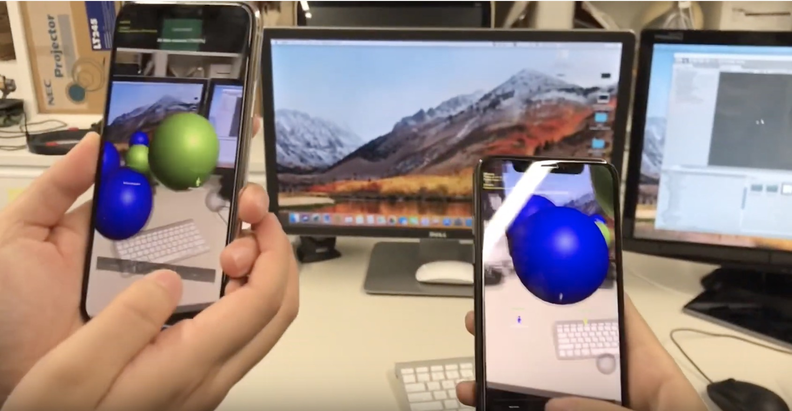

# Portable Augmented Reality-Based Multi-User Data Exploration Experience #

[This software now supports new ARKit functionality exposed in Unity ARKit Plug-in 2.0 Beta.]

This is a native [Unity](https://unity3d.com/) plugin that exposes the functionality of Apple
[ARKit SDK](https://developer.apple.com/arkit/) to your Unity projects for compatible iOS devices.  This documentation assumes that the developers are familiar with Unity software and ARKKit framework. It includes ARKit features such as world tracking, pass-through camera rendering, horizontal and vertical plane detection and
update, face tracking (requires iPhone X), image anchors, point cloud extraction, light estimation, and hit testing API to Unity developers for their AR projects. This plugin is a _preview quality_ build that
will help you get up and running quickly, but the implementation and APIs are subject to change.  Nevertheless, it is quite capable of creating a full featured ARKit app, and hundreds of ARKit apps on the AppStore already use this plugin.

The code drop is a Unity project, and it is only compatible with Unity 2017.4.
The coding project is based on the example in [CaptainsMess](https://github.com/hengineer/CaptainsMess)
The network connection is currently use the [High-Level-API](https://docs.unity3d.com/Manual/UNetUsingHLAPI.html)

## Requirements: ##
* [Unity](https://unity3d.com/get-unity/download) v2017.4
* Visual Studio 2017 or later
* Apple [Xcode](https://developer.apple.com/xcode/) with latest iOS SDK that contains ARKit Framework
* Apple iOS device that supports ARKit (iPhone X)
* Mac support latest OS operating system
* Apple [iOS 11.3 or later] installed on device
* Unity ARKit-[Plug-in master version](https://bitbucket.org/Unity-Technologies/unity-arkit-plugin)
* Network support multi-user protocol

## Building ##

Downloading the file and open this whole project in Unity version 2017.4. Notice that this artefact is over 1.1GB.
Choose build settings to iOS platform in Unity and compile the code in XCode. Set the certification into another string and player setting versions to iOS 12. (explain the detailed string and give example) 
After this project has been built, users can directly open [Unity-iPhone.xcodeproj] test module. Click the project name and then 
in develop group, set the individual icloud account as developer certification.
In XCode, the codes are compiled to Objective-C. Users can deploy the code on several iPhones and open the app to create shared session.

<h4>API</h4>

Here shows the steps need to be set by Unity Network and high level API.

<b>AutoConnect()</b> starts joining or hosting as appropriate. This is what Spaceteam does when you dial "Play".  
<b>StartHosting()</b> starts hosting a game as the server  
<b>StartJoining()</b> starts joining any servers it finds, but will not host  
<b>Cancel()</b> aborts the connection or disconnect from a lobby  
<b>Players()</b> returns a list of all the connected players  
<b>LocalPlayer()</b> returns the player associated with the local device  
<b>AreAllPlayersReady()</b> returns true if all players have marked themselves ready  
<b>CountdownTimer()</b> returns the remaining time in the countdown (or 0 if the countdown is not running)  
<b>IsConnected()</b> returns true if connected to other devices  
<b>IsHost()</b> returns true if this device is the host/server  
<b>StartLocalGameForDebugging()</b> is the same as StartHosting but temporarily sets minPlayers to 1 so that you can start a single-player game  
<b>FinishGame()</b> call this when your game is over if you want to return to the lobby with the same players  
<b>ForceServer(bool forceServer)</b> give the device a high 'serverScore' so that it will be preferred when choosing a server  

<b>SendReadyToBeginMessage()</b> Tell the server that this player is ready  
<b>SendNotReadyToBeginMessage()</b> Tell the server that this player is NOT ready  
<b>OnClientReady(bool readyState)</b> Called when the player's ready state changes  
<b>OnClientEnterLobby()</b> Called when the player enters a lobby  
<b>OnClientExitLobby()</b> Called when the player exits a lobby  
<b>CaptainsMessListener</b> callbacks  
 
<b>OnServerCreated()</b> (Server only) Called after the server has started so you can do additional setup (eg. spawn network objects)  
<b>OnStartGame(List)</b> (Server only) Called when all players are ready and the countdown has finished. This is when your game should take over do whatever it needs to.  
<b>OnAbortGame()</b> (Server only) Called if any player disconnects after the game has started. You should end your game at this point. At the moment there is no support for disconnecting/reconnecting while a game is in progress.  
<b>OnCountdownStarted()</b> (Server only) Called when all players have marked themselves ready  
<b>OnCountdownCancelled()</b> (Server only) Called if any player stops being ready during the countdown  
<b>OnJoinedLobby()</b> Called when the player joins a lobby  
<b>OnLeftLobby()</b> Called when the player leaves a lobby or is disconnected  
<b>OnStartConnecting()</b> You can override this if you want to show feedback that the game has started the connection process  
<b>OnStopConnecting()</b> You can override this if you want to show feedback that the game has stopped the connection process  
<b>OnReceivedBroadcast()</b> You can override this if you want to show feedback about the network traffic  
<b>OnDiscoveredServer()</b> You can override this if you want to show feedback about the network traffic.  

## Useful components ##
<h4>ARKit</h4>
I use the ARWorldTracking, ARAnchor and ARSession in Unity ARKit Plug-in package.

<h4>Unity</h4>
I use the high level API and I set the network manager and lobby manager to control the  network.

### ARKit 2.0 Beta Update ###

The ARKit package is based on Unity ARKit-Plug-in 2.0 Beta.
It could be updated after each iteration. The Asset file can be updated after each update.

### Demo for this app ###

 

The detailed demo operations are videoed in the link [https://www.youtube.com/watch?v=5a-Ffet1rVk](https://www.youtube.com/watch?v=5a-Ffet1rVk) 

## Questions?  Bugs? Showcase? ##

Contact Zeruo.Liu@anu.edu.au if there are some questions 

## Reference

https://github.com/hengineer/CaptainsMess

